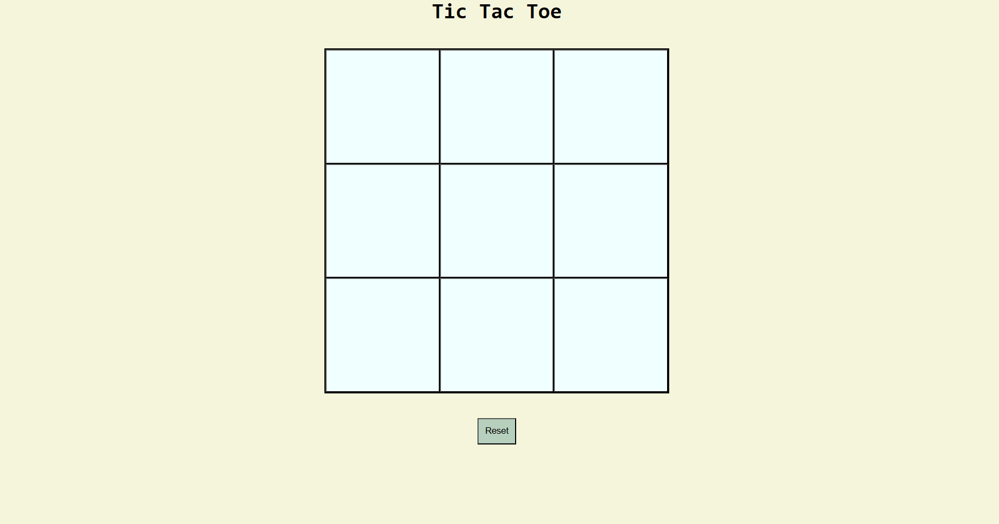

# Sankar S Pillai's Portfolio

Welcome to my personal portfolio website! This project showcases my background, skills, and projects as a Computer Science student passionate about full-stack web development.

## 🚀 Live Demo

Check out the live site: [https://iamsan06.github.io/portfolio/](https://iamsan06.github.io/portfolio/)

## 📂 Project Structure

```
.
├── index.html         # Home page (About Me)
├── project.html       # Projects showcase (dynamic with JS)
├── contact.html       # Contact form (Formspree integration)
├── portfolio.css      # All styling for the site
├── portfolio.js       # JavaScript for dynamic project rendering
├── resume.pdf         # My resume/CV
├── tictactoe.png      # Project image example
└── ...                # Other assets
```

## 🌟 Features

- **Responsive Design:** Optimized for various devices (add media queries for best results)
- **Dynamic Projects:** JavaScript-powered project section for easy updates
- **Contact Form:** Integrated with [Formspree](https://formspree.io/) for easy communication
- **Modern Fonts:** Uses Google Fonts for a fresh look
- **Downloadable Resume:** Visitors can download my CV

## 🛠️ Built With

- HTML5
- CSS3 (Flexbox)
- JavaScript (ES6+)
- [Formspree](https://formspree.io/) (for contact form)
- [GitHub Pages](https://pages.github.com/) (for hosting)

## 📸 Screenshot



## 📝 How to Use

1. **Clone this repo:**
   ```sh
   git clone https://github.com/iamsan06/portfolio.git
   cd portfolio
   ```
2. **Open `index.html` in your browser** to view the site locally.
3. **Edit content:** Change HTML, CSS, JS, or add new projects in `portfolio.js`.
4. **Deploy:** Push to your GitHub repo and enable GitHub Pages for deployment.

## 🙏 Acknowledgements

- Thanks to [Google Fonts](https://fonts.google.com/) and [Formspree](https://formspree.io/) for free tools.

## 📈 Future Improvements

- Add more interactive JavaScript features
- Improve responsiveness for mobile
- Enhance accessibility

---

> This is my first web project—thanks for visiting! Please feel free to suggest improvements or report issues.
